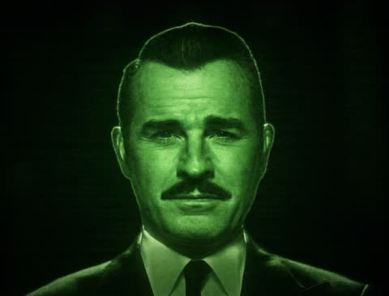
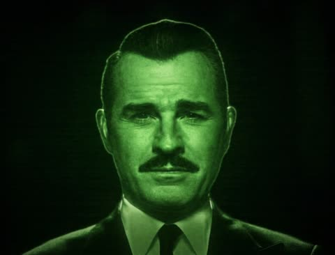

# Digital Clone

An interactive talking-head clone built from two model families only:

- **Qwen3-TTS** clones a reference voice and generates a complete WAV file.
- **Ditto Talking Head** animates a source portrait from that WAV file.

The default offline mode renders a complete synchronized MP4, applies a visual
style, and loads each response into one persistent MPV window. A lower-latency
live mode is included for experimentation.

## Results

Unofficial AI-generated **Mr. House (Fallout: New Vegas)** demonstrations,
using the local clone name `dr-house`. Click a preview to open its video with sound.

| Example | Video preview |
| --- | --- |
| House demo 1 | [](examples/dr-house/ditto_offline_20260905_070806_00002.mp4) |
| House demo 2 | [](examples/dr-house/ditto_offline_20260905_072719_00002.mp4) |
| House demo 3 | [](examples/dr-house/ditto_offline_20260905_073602_00002.mp4) |
| House demo 4 | [](examples/dr-house/ditto_offline_20260905_081237_00003.mp4) |
| House demo 5 | [](examples/dr-house/ditto_offline_20260905_081237_00004.mp4) |

## What is in the repository

Application orchestration and service code is in `tools/`. Ditto is pinned as a
Git submodule under `vendors/Ditto`. Qwen is installed as a Python package and
its model is downloaded from Hugging Face on first use.

Large checkpoints, generated output, Python environments, and face/voice inputs
are deliberately excluded from Git.

## Requirements

- Linux x86-64
- An NVIDIA GPU supported by the selected Ditto TensorRT engines
- A compatible NVIDIA driver
- Docker Engine with the NVIDIA Container Toolkit
- Git and curl
- Roughly 30 GB of free disk space for the image, checkpoints, and model cache

The supplied Ditto engines target **Ampere or newer** GPUs. Other architectures
must generate compatible TensorRT engines from Ditto's ONNX checkpoints; see
`vendors/Ditto/README.md`.

Docker isolates the Python/CUDA user-space dependencies. It cannot replace the
host NVIDIA driver or make TensorRT engines portable across unsupported GPU
architectures.

## Quick start

Clone with the pinned Ditto source:

```bash
git clone --recurse-submodules <your-github-repository-url>
cd digital-clone
```

Download the pinned Ditto configuration and Ampere+ TensorRT engines. The
script resumes interrupted downloads and verifies every file:

```bash
./scripts/download-models.sh
```

Create a clone on the host (Python 3.10+):

```bash
python3 tools/clone_profiles.py create
```

The wizard asks for a clone name, portrait, voice WAV, and the exact transcript
of that reference recording. Enter a file path to copy it into the project,
`camera` to take a photo, `record` to record the microphone, or `write` to enter
the transcript. Finish a typed transcript by pressing Enter on an empty line (or entering `.`).
Camera capture uses Linux V4L2; microphone recording uses PulseAudio/PipeWire.
Both require host FFmpeg and access to the device. Recording asks for a duration
and starts after you press Enter. Supplied paths support `~`; enter paths without
shell quotes at the interactive prompt. Original files are left untouched.

You can prefill any fields and answer the remaining prompts:

```bash
python3 tools/clone_profiles.py create --name personal --image /path/to/portrait.png
python3 tools/clone_profiles.py list
```

Each clone is self-contained. Each run gets a separate output session:

```text
inputs/
└── personal/
    ├── clone.json
    ├── avatar.png
    ├── reference.wav
    └── reference.txt
outputs/
└── personal/
    └── session_<timestamp>/
        ├── audio/           # generated voice WAVs
        ├── videos/          # complete offline response MP4s
        ├── live/            # live model working files
        ├── session.mp4      # complete live recording, when enabled
        └── session.mp4.json # recording timing metadata
```

Only files relevant to the chosen mode are created. Inputs and outputs remain
ignored by Git. Clone names use lowercase letters, digits, hyphens and underscores.
Existing names are rejected, and cancelled creation leaves no partial clone.

The existing House assets are configured locally as `dr-house`:

```bash
./scripts/run-docker.sh --clone dr-house --mode live
```

Older House-generated audio and videos are preserved under
`outputs/dr-house/legacy/audio/` and `outputs/dr-house/legacy/videos/`.
New runs use separate session directories. All runs require `--clone NAME`.
Private clone profiles are local and are not included when cloning this repository.

Run the desktop container:

```bash
./scripts/run-docker.sh --clone personal --mode offline
```

The first run builds the image and downloads the Qwen model into
`.cache/huggingface`. Later runs reuse both caches.

If Docker reports permission denied for `/var/run/docker.sock`, configure your
normal user for Docker daemon access using Docker's official post-installation
instructions, then sign out and back in. The runner intentionally does not
silently elevate itself with `sudo`.

As a temporary alternative, preserve the desktop variables explicitly:

```bash
sudo --preserve-env=DISPLAY,XAUTHORITY,XDG_RUNTIME_DIR \
  ./scripts/run-docker.sh --clone personal --mode offline
```

To force an image rebuild after changing dependencies:

```bash
./scripts/run-docker.sh --build --clone personal --mode offline
```

The build and runtime use the Linux host network for package and first-run Qwen
downloads. This avoids the common case where the host DNS works but Docker's
bridge resolver cannot reach Ubuntu, NVIDIA, PyTorch, PyPI, or Hugging Face. If
name resolution still fails, fix the Docker daemon's DNS configuration and
restart Docker before retrying.

## Rendering modes

Offline mode is the recommended synchronized path:

```bash
./scripts/run-docker.sh --clone personal --mode offline
```

The full audio duration determines Ditto's exact 25 FPS frame count. Only after
Ditto finishes are the untouched audio timeline and rendered frames muxed into
one MP4. Playback waits for the file's real end-of-stream.

Live mode streams raw audio and frames through FFmpeg/FFplay:

```bash
./scripts/run-docker.sh --clone personal --mode live
```

Live mode has lower initial latency, but its timing also depends on real-time
generation throughput, buffering, desktop scheduling, and GPU contention.

### Save live video and voice

Live mode saves the generated session, including synthesized voice, to a unique
`outputs/<clone>/session_<timestamp>/session.mp4` by default. Set a filename explicitly or
turn recording off:

```bash
./scripts/run-docker.sh --clone personal --mode live --record-video /app/outputs/personal/my-demo.mp4
./scripts/run-docker.sh --clone personal --mode live --no-record-video
```

Type `/quit` (or `/exit`) and wait for `Live recording saved` before closing the
terminal. Finalization drains queued frames and combines the timestamped voice
clips into the MP4. Existing destination files are rejected to prevent accidental
overwriting. This records the generated media timeline, including inter-utterance
gaps; it does not capture the desktop, microphone, or wall-clock time spent typing
and waiting for generation. A timing JSON sidecar stays beside the recording.

For repeatable playback, `--script-file PATH` reads one utterance per nonempty
line and exits after processing it. Put private scripts under `inputs/<clone>/`
and use `/app/inputs/<clone>/script.txt` inside Docker.

Finished videos remain under `outputs/<clone>/session_<timestamp>/`.
`examples/` contains selected public demo videos and their README preview images.
Copy only finished clips you want to publish there; private inputs and other
outputs remain ignored by Git.

For a machine without a desktop display, render files without playback:

```bash
CLONE=personal docker compose run --rm digital-clone
```

Generated files are written under `outputs/`.

## Visual styles

Offline output defaults to the `cinematic` treatment. Built-in options are:

```bash
./scripts/run-docker.sh --clone personal --mode offline --style natural
./scripts/run-docker.sh --clone personal --mode offline --style cinematic
./scripts/run-docker.sh --clone personal --mode offline --style warm
./scripts/run-docker.sh --clone personal --mode offline --style cool
./scripts/run-docker.sh --clone personal --mode offline --style noir
```

`natural` preserves Ditto's video stream without re-encoding it. Other presets
apply color, contrast, and optional vignette layers while retaining the same
audio timestamps.

Advanced compositions can supply any FFmpeg single-input video filter chain:

```bash
./scripts/run-docker.sh --clone personal --mode offline \
  --video-filter "eq=contrast=1.1:saturation=0.85,vignette=PI/4"
```

The custom chain overrides `--style`.

## Startup interface

The terminal and persistent video window display initialization progress while
Ditto and Qwen load. When both models are ready, the window replaces the startup
screen with the configured avatar image before the first `you>` prompt. After
each response finishes playing, it returns to that avatar image while waiting
for the next message.

The terminal version uses an animated bar:

```text
Starting digital clone (offline mode)...
  [━━━━━━━━━━━━━━━ ● ──────────────]  50%  Loading voice model
```

Use `--no-progress` for plain CI logs or `--verbose` to expose the complete
Qwen and Ditto diagnostic streams.

## Desktop playback from Docker

`scripts/run-docker.sh` forwards the current X11 display and PulseAudio/PipeWire
runtime socket, then runs the container with your host UID. One long-lived MPV
process receives each completed file over a local IPC socket, so its window is
not destroyed between responses. On a Wayland-only session, XWayland must be
enabled. If `DISPLAY` is unavailable, the script adds `--no-playback` and still
saves complete videos. Native installations without MPV retain GStreamer as a
fallback player.

If X11 rejects the local container connection, authorize the current local user
according to your distribution's X11 policy and run the command again. Avoid
globally disabling X server access control.

## Architecture and synchronization

```text
terminal text
    │
    ▼
Qwen3-TTS ── complete WAV ──► Ditto ── 25 FPS frames
                                      │
                                      ▼
                             aesthetic FFmpeg stage
                                      │
                                      ▼
                           synchronized MP4 + playback
```

Qwen and Ditto run in separate Python environments. This is intentional: Ditto
uses TensorRT 8.6 and cuDNN 8, while the Qwen process uses its own PyTorch CUDA
libraries. The launcher removes Ditto's explicit cuDNN override from Qwen but
retains NVIDIA runtime driver paths.

## Useful commands

```bash
make init          # initialize the Ditto submodule
make models        # download Ditto configs and Ampere+ engines
make build         # build the local image
make run CLONE=personal           # synchronized desktop/offline mode
make run-live CLONE=personal      # experimental live mode
make run-headless CLONE=personal  # offline rendering without a media window
```

Type `/quit` or `/exit` in the application to shut down both model services.

## Privacy and publication

Voice recordings and face images are biometric data. Confirm `.gitignore` is in
effect and inspect `git status` before every public push. Do not publish generated
media without the subject's consent.

This repository does not currently choose a license for its original integration
code. Select one before public release. Ditto and model/runtime components retain
their own terms; see `THIRD_PARTY_NOTICES.md`.
